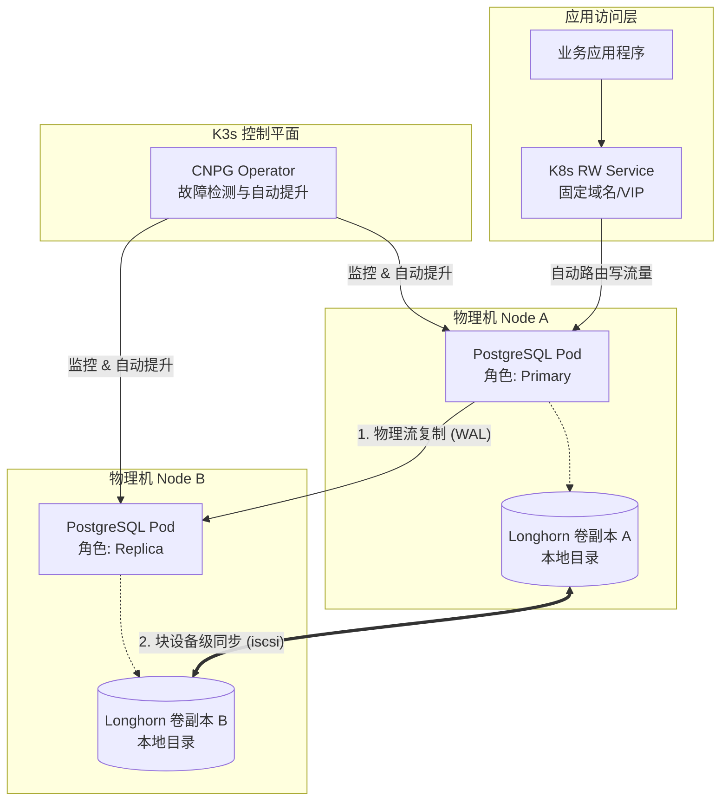
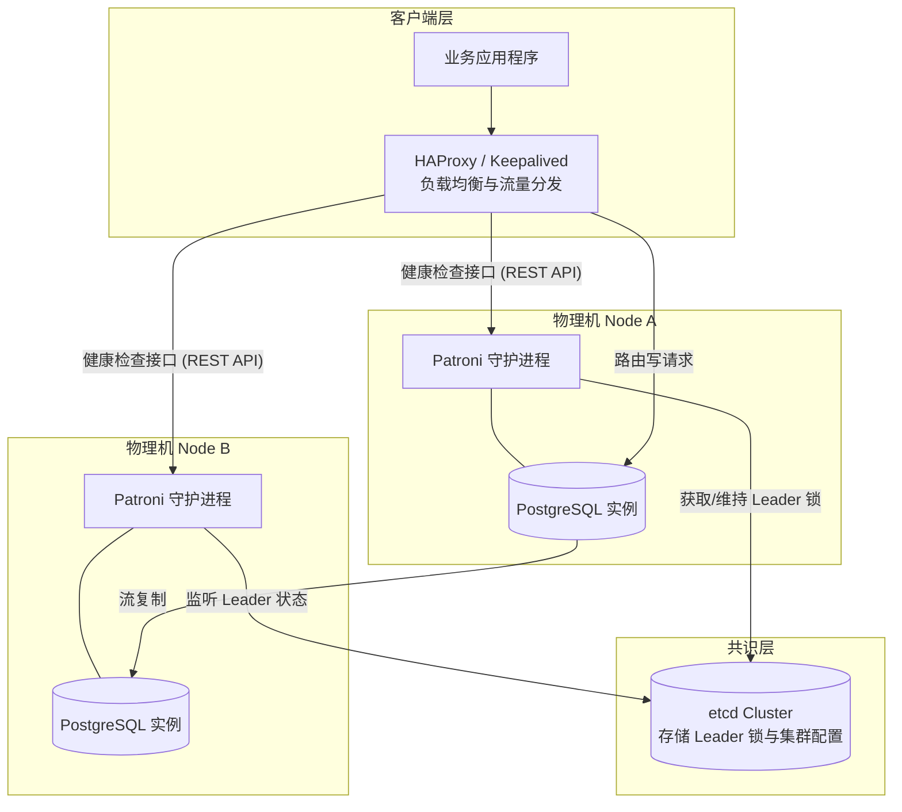

# PostgreSQL 主从复制（Streaming Replication）

```text
             WAL日志流（流复制）
[Primary 主库]  ───────────►  [Standby 从库]
       │                          │
       └────客户端读写            └──（可选：只读查询）
```


## 主库配置

编辑 `postgresql.conf`：

```conf
# 开启WAL日志
wal_level = replica
archive_mode = on
archive_command = 'cp %p /var/lib/postgresql/archive/%f'
max_wal_senders = 10
wal_keep_size = 512  # in megabytes; 0 disables

# 建议开启日志
log_connections = on
log_disconnections = on
```

编辑 `pg_hba.conf`，允许从库连接复制：

```conf
# host replication 用户 IP段 认证方式
host replication repl_user 192.168.1.0/24 scram-sha-256
```

 `pg_hba.conf`可在psql中执行一下SQL命令进行配置重载：

```shell
SELECT pg_reload_conf();
```

或者执行以下shell命令：

```shell
pg_ctl reload -D /path/to/your/data_directory
```

当然也可重启postgresql服务。


创建专用于复制任务的用户（推荐创建）：

```bash
psql -U postgres  #或者切换到postgres用户然后用psql即可进入命令行
# 目前的版本ENCRYPTED总是默认的，因此不写也可以
CREATE ROLE repl_user with REPLICATION LOGIN ENCRYPTED PASSWORD 'your_password';
```


##  从库准备

使用postgres用户执行（如果不是则需要同步完主库数据后将data目录递归授权给postgres）。

在从库上清空data数据并同步主库数据：

```bash
rm -rfv /var/lib/postgresql/data/*
pg_basebackup -h 主库IP -U repl_user -D /var/lib/postgresql/data --wal-method=stream -P
```

创建 `standby.signal` 文件（表示从库身份）：

```bash
touch /var/lib/postgresql/data/standby.signal
```

配置 `postgresql.conf`：

```conf
primary_conninfo = 'host=主库主机名或IP port=5432 user=repl_user password=your_password'
```

启动从库

```bash
systemctl start postgresql
```

现在从库会通过 WAL 流复制主库的数据，**从库默认是只读的**。


# 高可用配置（HA）方案

主从复制只解决数据复制问题，并 **不具备自动切换能力**，主库宕机会导致整个服务不可用，因此需要引入 **高可用机制**。

这里介绍两种场景的方法，根据业务情况选择：

| **维度**     | **K3s + CNPG + Longhorn**                                    | **Patroni + Etcd + HAProxy**                                 |
| ------------ | ------------------------------------------------------------ | ------------------------------------------------------------ |
| **部署难度** | **低**。几个 YAML 文件搞定。                                 | **高**。需要配置 Etcd 集群、HAProxy 规则、Keepalived 等。    |
| **自愈能力** | **极强**。机器重启后，Pod 自动拉起，老主库自动执行 `pg_rewind` 归队。 | **强**。但需要精细配置，否则老主库重启后可能需要人工介入处理“脑裂”。 |
| **存储安全** | **双重保护**。PG 逻辑同步 + Longhorn 磁盘块同步。硬盘坏了也不怕。 | **单重保护**。仅靠 PG 物理流复制。如果主从机器硬盘同时坏了，数据就丢了。 |
| **性能开销** | **中/高**。Longhorn 网络存储会有一定延迟。                   | **极低**。直接读写物理本地硬盘，几乎无损。                   |
| **适用环境** | **现代 IT 架构**、公司内部私有云、追求无人值守。             | **超大规模写入**、裸金属服务器、禁止使用容器化技术的传统金融/电信场景。 |


## K8S/K3S + CNPG + Longhorn

组件：

| **层级**       | **组件**              | **作用**                                         |
| -------------- | --------------------- | ------------------------------------------------ |
| **基础架构层** | **2 台 Linux 物理机** | 提供计算和磁盘空间。                             |
| **集群管理层** | **K3s**               | 把两台机器合二为一，负责容器的调度和监控。       |
| **存储层**     | **Longhorn**          | 把两台机器的本地目录虚拟成“高可用云硬盘”。       |
| **数据库层**   | **CNPG**              | 负责 PG 的主从切换、备份、老主归队、自动快照。   |
| **应用访问层** | **K8s Service**       | 提供固定域名（如 `my-db-rw`），代码永远不改 IP。 |

架构:



可以选择K8S或者精简的K3S，这里以两节点的K3S为例，假设两个主机 IP 分别为：

- **Node A (Master):** `192.168.1.10`
- **Node B (Worker):** `192.168.1.11`

------

### 1. 安装 K3s 集群

1. 在 Node A (Master) 执行：

   ```shell
   curl -sfL https://get.k3s.io | sh -
   # 获取 Token，稍后从节点加入需要用到
   cat /var/lib/rancher/k3s/server/node-token
   ```

2. 在 Node B (Worker) 执行：

   将下面的 `<TOKEN>` 替换为刚才获取的内容：

   ```shell
   curl -sfL https://get.k3s.io | K3S_URL=https://192.168.1.10:6443 K3S_TOKEN=<TOKEN> sh -
   ```

3. 验证集群：

   在 Node A 执行 `kubectl get nodes`，看到两个节点都处于 `Ready` 状态即可。


### 2. 部署 Longhorn 分布式存储

Longhorn 将利用你两台机器的本地目录构建高可用存储池。

1. 在两个主机上Longhorn 需要一些基础组件：

   ```shell
   #Debian
   sudo apt install open-iscsi nfs-common -y
   
   #RHEL 中，open-iscsi 的包名通常就是 iscsi-initiator-utils
   sudo dnf install iscsi-initiator-utils nfs-utils -y
   ```

2. 安装 Longhorn

   在 Node A 执行

   ```shell
   kubectl apply -f https://raw.githubusercontent.com/longhorn/longhorn/v1.5.3/deploy/longhorn.yaml
   ```

   *安装完成后，可通过端口转发访问它的 UI 面板，观察两台机器的磁盘是否被识别。*


### 3. 安装 CloudNativePG (CNPG)

1. 安装 Operator

   - 在 Node A 执行：

     ```shell
     kubectl apply -f https://raw.githubusercontent.com/cloudnative-pg/cloudnative-pg/release-1.22/releases/cnpg-1.22.0.yaml
     ```

     

### 4. 部署 PostgreSQL 高可用集群

编写一个 YAML 文件，定义数据库需求。这个配置文件包含了：

- **2 个实例**（一主一从）。
- **自动切换**。
- **使用 Longhorn 存储**。

在 Node A 创建 `cluster.yaml`：

```yaml
apiVersion: postgresql.cnpg.io/v1
kind: Cluster
metadata:
  name: company-db
spec:
  instances: 2
  # 存储配置
  storage:
    size: 20Gi
    storageClass: longhorn  # 指定使用 Longhorn 提供的分布式存储
  # 监控与自愈配置
  postgresql:
    parameters:
      max_connections: "100"
      shared_buffers: "512MB"
```

执行部署命令：

```
kubectl apply -f cluster.yaml
```


### 5. 连接数据库

CNPG 会自动创建三个 Service，使用以下地址连接数据库

- **写操作（主库）**: `company-db-rw.default.svc:5432`

- **读操作（从库）**: `company-db-ro.default.svc:5432`


## Patroni + etcd + HAProxy

| 组件           | 作用                               |
| -------------- | ---------------------------------- |
| **Patroni**    | 管理 PostgreSQL 主从状态、自动选主 |
| **etcd**       | 存储集群状态（选主一致性协议）     |
| **HAProxy**    | 作为代理层，自动路由到主库         |
| **Keepalived** | 提供高可用虚拟 IP（VIP）           |

根据不同需求组合：

| 目标         | 建议方式                            |
| ------------ | ----------------------------------- |
| 主从复制     | Streaming Replication               |
| 自动故障转移 | Patroni + etcd + HAProxy            |
| 高可用地址   | HAProxy + Keepalived (VIP)          |
| 数据备份     | pg_basebackup / pgBackRest / Barman |
| 防止单点故障 | etcd + 多从库 + HAProxy健康检查     |

架构：



### 1. 部署 ETCD 集群

1~3 台机器，配置参考：

```bash
etcd --name node1 --initial-advertise-peer-urls http://localhost:2380 \
     --listen-peer-urls http://localhost:2380 \
     --listen-client-urls http://0.0.0.0:2379 \
     --advertise-client-urls http://localhost:2379 \
     --initial-cluster-token etcd-cluster-1 \
     --initial-cluster node1=http://localhost:2380 \
     --initial-cluster-state new
```


### 2. 配置 Patroni（每台 PostgreSQL 节点）

配置文件示例 `/etc/patroni.yml`：

```yaml
scope: postgres_cluster
name: node1

etcd:
  host: 127.0.0.1:2379

postgresql:
  data_dir: /var/lib/postgresql/data
  bin_dir: /usr/lib/postgresql/14/bin
  authentication:
    superuser:
      username: postgres
      password: your_password
    replication:
      username: repl_user
      password: your_password
  parameters:
    wal_level: replica
    hot_standby: "on"
    max_wal_senders: 10
    wal_keep_size: 512MB

bootstrap:
  initdb:
    - encoding: UTF8
    - locale: en_US.UTF-8
    - data-checksums
  users:
    postgres:
      password: your_password
  dcs:
    ttl: 30
    loop_wait: 10
    maximum_lag_on_failover: 1048576
    postgresql:
      use_pg_rewind: true
      parameters:
        archive_mode: "on"
        archive_command: "cp %p /var/lib/postgresql/archive/%f"

restapi:
  listen: 127.0.0.1:8008
  connect_address: 127.0.0.1:8008

tags:
  nofailover: false
  noloadbalance: false
  clonefrom: false
```

启动：

```bash
patroni /etc/patroni.yml
```


### 3. 配置 HAProxy

```bash
# /etc/haproxy/haproxy.cfg

frontend pgsql
    bind *:5432
    default_backend postgresql_backend

backend postgresql_backend
    option httpchk GET /master
    server node1 192.168.1.101:5432 check port 8008
    server node2 192.168.1.102:5432 check port 8008
```

让 HAProxy 只把流量导向主节点（Patroni 提供 HTTP 检查 `/master`）。


### 4. Keepalived 提供 VIP（可选）

设置一个虚拟 IP，保证客户端连接固定地址，HAProxy 切换内部真实节点。